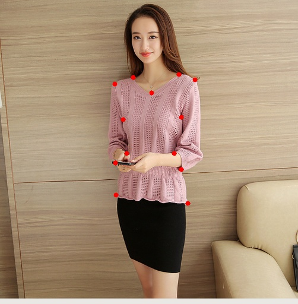
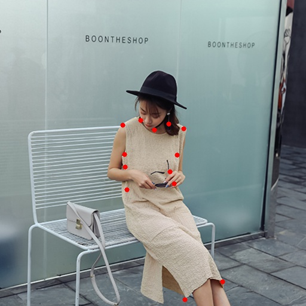
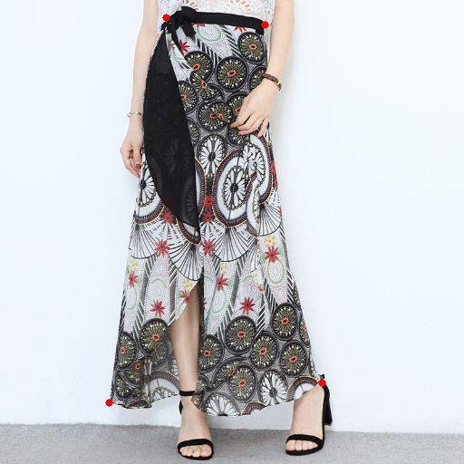
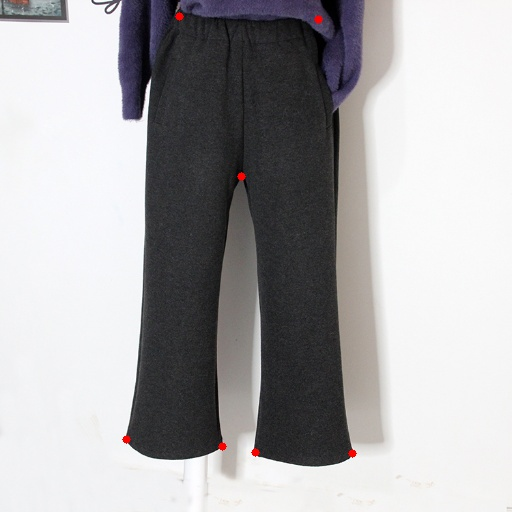

# A Pytorch implementation of Convolutional Pose Machine(CPM) and Feature Pyramid Netword(FPN) for FashionAI Key Points Detection

This code references some of the ideas of others on github and is based on the paper [realtime multi-person pose estimation in CVPR'17 (Oral)](https://arxiv.org/abs/1611.08050) . The final result is 56 on the leaderboard, and the score is 6.38%. It is not bad for me a freshman in the DeepLearning :) You can take the code as your baseline solution.

There are some visiable results as follows:

    

 Example output of CPM + FPN with ResNet-50 

You can reproduce my result by following steps.
## STEP ONE

### Dependency

- Python version 3.5
- Numpy
- Pandas
- PyTorch
- cv2
- tqdm
- Keras(TensorFlow backend)

### Data Preparation

Download [FashionAI dataset](https://tianchi.aliyun.com/competition/information.htm?spm=5176.11165261.5678.2.34b72ec5iFguTn&raceId=231648&_lang=en_US) and put files in such structure:

step1: make sure that your image data and annotations are in the fold 'data'.The data directory structure is as follows:

	DATA_DIR/
		   |-- test/
		   |    |-- test.csv
		   |    |-- Images/
		   |    |    |-- blouse
		   |    |    |-- ...
		   |-- train/
		   |    |-- Annotations/
		   |    |    |-- train.csv
		   |    |-- Images/
		   |    |    |-- blouse
		   |    |    |-- ...
		   |-- ...
### Some Pretrained model parameters download address
1. [ MASK-RCNN](https://pan.baidu.com/s/12_4EPT6_E6dedNriA-ifeQ#list/path=%2F) for detecting fashion location (put the prameters file in the $ROOT/utils/)

2. [resnet-50](https://download.pytorch.org/models/resnet50-19c8e357.pth) in Pytorch (put the prameters file in the $ROOT/detection/model/)

## STEP TWO
### Train your model form scratch
1. After putting all the data in the appropriate directory. You should first run the `$ROOT/code/data_preprocess.py` to preprocess the raw data.

2. For training， you can just run the `$ROOT/code/train_net.py`, the training process took me about 6 hours with one GPU(1080Ti). Also you can modify the `$ROOT/code/config.yml` just fit your environment. The parameters will be saved in the path of `$ROOT/saveparameter/`

3. Also you can take my trained model parameters for pretrained model or demo test. click here to download.

### Test your model and make the submit results
1. After training your models, you should first run the `$ROOT/detection/code/getRoi.sh` for get the object locations information. The information will be saved in the path of `$ROOT/detection/code/submit/`. We set additional margin for the detection bounding box, you can midify this configration in the `$ROOT/detection/code/clothes_test_ori.py/` line 228.

2. Then you should run the `$ROOT/code/submitDect.py` to gain your results.

## Inference
1. There are some papers I think worthy for reading, they are:

《Realtime Multi-person Pose Estimation》

《Cascaded Pyramid Network for Multi-Person Pose Estimation》

《Attentive Fashion Grammar Network for Fashion Landmark Detection and Clothing Category Classification》

 